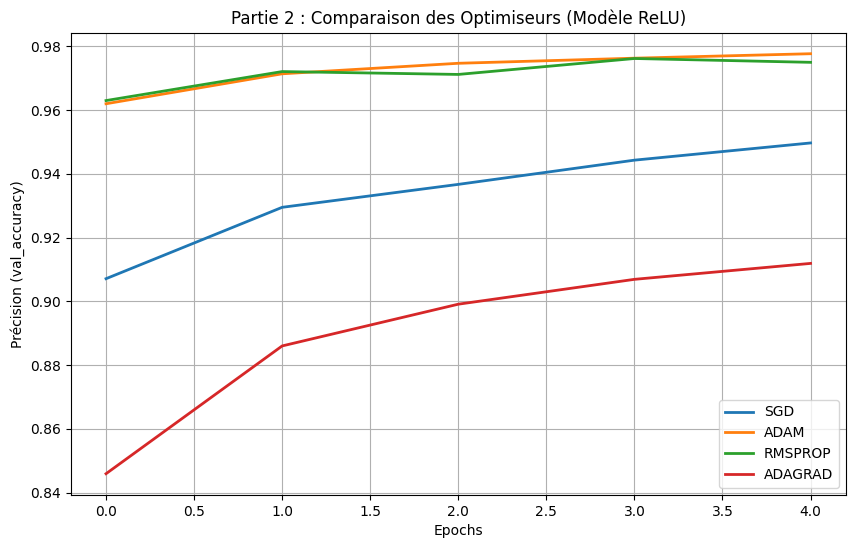
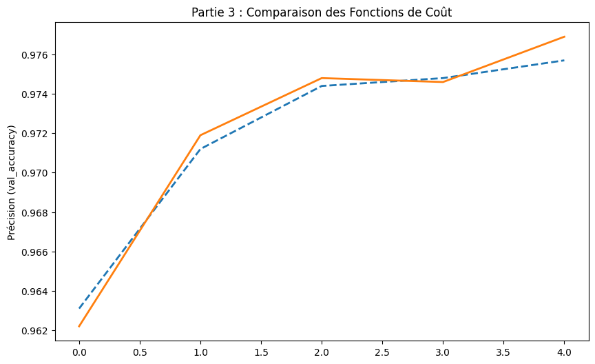

# TP1 — Problème MNIST : Classification de Chiffres Manuscrits

---

## 👥 Équipe

**Abdelnour ALEM · Faouzi MATMATI · Sophian MANGANELLO**  
L3 TRI — Université Savoie Mont Blanc | ETRS606 : IA Embarquée

---

## Introduction

Le jeu de données **MNIST** (*Modified National Institute of Standards and Technology*) est un benchmark classique en apprentissage automatique pour la classification d'images. Il contient **70 000 images** en niveaux de gris de chiffres manuscrits (0 à 9), chacune de taille **28×28 pixels**, soit 784 pixels au total.

L'objectif de ce TP est de prédire correctement le chiffre associé à chaque image parmi les **10 classes possibles (0–9)** en implémentant et en comparant plusieurs variantes de réseaux de neurones denses (Multi-Layer Perceptron, MLP).

Chaque image est aplatie en un vecteur `[1 × 784]` avant d'être passée au réseau. Le modèle est composé :
- d'une **couche d'entrée** de dimension 784,
- de **couches cachées** selon la configuration testée,
- d'une **couche de sortie** dense de 10 neurones (distribution de probabilité sur les 10 classes).

L'apprentissage est réalisé par **descente de gradient** en minimisant la fonction de coût choisie.

---

## Objectifs

1. Comprendre l'impact du choix de la **fonction d'activation** sur les performances du réseau.
2. Comparer différents **algorithmes d'optimisation** en termes de vitesse de convergence et précision finale.
3. Choisir la **fonction coût** la plus adaptée au problème de classification multi-classes.
4. Analyser les compromis entre **précision, taille du modèle et vitesse d'apprentissage**.

---

## Environnement & Outils

| Outil | Version / Détail |
|-------|-----------------|
| **Google Colab** | Environnement d'exécution Python (GPU T4) |
| **Python** | 3.x |
| **TensorFlow / Keras** | 2.x |
| **Dataset** | `tensorflow.keras.datasets.mnist` |
| **Epochs** | 5 pour toutes les expériences |
| **Optimiseur de référence (Partie 1)** | Adam |
| **Fonction coût de référence (Partie 1)** | `categorical_crossentropy` |

---

## Partie 1 — Choix de la Fonction d'Activation

### Méthodologie

Pour isoler l'impact de la fonction d'activation, toutes les expériences de cette partie utilisent les mêmes hyperparamètres : optimiseur **Adam** et fonction coût **`categorical_crossentropy`**.

Quatre modèles ont été construits et comparés :

| Modèle | Architecture | Fonction d'activation | Paramètres |
|--------|-------------|----------------------|-----------|
| **A — Baseline (Softmax)** | Entrée → Sortie (2 couches) | Softmax uniquement | ~7 850 |
| **B — ReLU** | Entrée → 128 → 64 → Sortie | ReLU (couches cachées) | ~118 282 |
| **C — Tanh** | Entrée → 64 → 32 → Sortie | Tanh (couches cachées) | ~55 050 |
| **D — Sigmoid** | Entrée → 64 → 32 → Sortie | Sigmoid (couches cachées) | ~55 050 |

> Le Modèle A ne comporte aucune couche cachée. Les Modèles B, C et D partagent la même profondeur (2 couches cachées) mais diffèrent par leur fonction d'activation.

### Résultats

*Figure 1 — Comparaison de la précision de validation (val_accuracy) sur 5 epochs pour les Modèles B (ReLU), C (Tanh) et D (Sigmoid). Le Modèle A (Softmax basique) n'est pas représenté car sa précision (~92.6%) est trop éloignée pour être comparée lisiblement.*

| Modèle | Précision finale (~5 epochs) | Vitesse de convergence | Taille |
|--------|-----------------------------|-----------------------|--------|
| **A — Softmax** | ~92.6% | Moyenne | Très léger |
| **B — ReLU** | ~97.5% | Très rapide | Léger |
| **C — Tanh** | **~97.6%** | Très rapide | Moyen |
| **D — Sigmoid** | ~97.4% | Lente | Moyen |

### Analyse

Le graphique met en évidence plusieurs tendances :

- **ReLU** converge très rapidement dès la première epoch grâce à l'absence du problème de *vanishing gradient*. C'est la fonction la plus couramment utilisée en pratique.
- **Tanh** atteint une précision légèrement supérieure à ReLU avec une architecture plus compacte (64→32 au lieu de 128→64). Elle est symétrique autour de 0, ce qui favorise une convergence stable.
- **Sigmoid** converge plus lentement en raison du *vanishing gradient* : les gradients deviennent très petits dans les couches profondes, ralentissant l'apprentissage.
- **Softmax seul** (sans couche cachée) atteint seulement 92.6% : le modèle est trop simple pour capturer les relations non linéaires entre les pixels.

**Choix retenu : Tanh** — meilleur compromis entre précision (~97.6%), taille du modèle (55 050 paramètres contre 118 282 pour ReLU) et vitesse de convergence.

---

## Partie 2 — Choix de l'Algorithme d'Optimisation

### Méthodologie

En conservant l'architecture **Modèle C (Tanh)** retenue précédemment, quatre optimiseurs ont été comparés sur 5 epochs.

| Optimiseur | Stratégie |
|-----------|-----------|
| **SGD** | Descente de gradient stochastique classique, taux d'apprentissage fixe |
| **Adam** | Combine momentum et RMSprop, adaptatif, très populaire |
| **RMSprop** | Adapte le taux d'apprentissage par paramètre, stable sur données variées |
| **Adagrad** | Learning rate décroissant par paramètre, efficace pour données creuses |

### Résultats

*Figure 2 — Évolution de la précision de validation sur 5 epochs pour les quatre optimiseurs appliqués au Modèle ReLU.*

| Optimiseur | Précision initiale (epoch 0) | Précision finale (~epoch 4) | Convergence |
|-----------|-----------------------------|-----------------------------|-------------|
| **Adam** | ~96.3% | **~98.0%** | Immédiate |
| **RMSprop** | ~96.2% | ~97.7% | Immédiate |
| **SGD** | ~90.8% | ~95.1% | Progressive |
| **Adagrad** | ~84.5% | ~91.2% | Lente |

### Analyse

- **Adam et RMSprop** dominent très nettement : ils dépassent 96% dès la première epoch grâce à leur mécanisme adaptatif. Adam s'impose légèrement comme meilleur en précision finale (~98.0%).
- **SGD** progresse de façon linéaire et régulière, démarrant à ~91% pour atteindre ~95%. Fiable mais lent : il nécessiterait davantage d'epochs pour rivaliser avec Adam.
- **Adagrad** présente les moins bonnes performances sur ce problème. Son taux d'apprentissage décroît trop rapidement, limitant sa capacité à apprendre efficacement sur 5 epochs seulement.

**Choix retenu : Adam** — convergence la plus rapide et précision finale maximale (~98.0%).

---

## Partie 3 — Choix de la Fonction Coût

### Méthodologie

Avec la meilleure configuration identifiée (architecture Tanh, optimiseur Adam), deux fonctions coût ont été comparées sur 5 epochs :

| Fonction coût | Usage typique | Format des labels |
|--------------|---------------|------------------|
| `categorical_crossentropy` | Classification multi-classes | One-hot encoding `[0,0,1,0,...]` |
| `sparse_categorical_crossentropy` | Classification multi-classes | Entiers `0, 1, 2, ...` |

### Résultats

*Figure 3 — Les deux courbes (categorical en orange, sparse en bleu pointillé) suivent une trajectoire quasi identique, atteignant toutes deux ~97.6–97.7% de précision.*

| Fonction coût | Précision finale | Différence |
|--------------|-----------------|-----------|
| `categorical_crossentropy` | ~97.7% | — |
| `sparse_categorical_crossentropy` | ~97.6% | < 0.1% |

### Analyse

Les deux courbes sont pratiquement superposées : elles effectuent **exactement le même calcul mathématique** en arrière-plan. La différence est purement **pratique** :

- `categorical_crossentropy` exige que les labels soient transformés en vecteurs one-hot (ex. le chiffre `3` → `[0,0,0,1,0,0,0,0,0,0]`), ce qui ajoute une étape de prétraitement et consomme plus de mémoire.
- `sparse_categorical_crossentropy` accepte directement les entiers (`3`), ce qui est naturel pour MNIST dont les labels sont des chiffres 0–9.

**Choix retenu : `sparse_categorical_crossentropy`** — équivalente mathématiquement, mais plus simple et plus efficace à utiliser avec ce dataset.

---

## Synthèse & Configuration Finale

| Paramètre | Choix retenu | Justification |
|-----------|-------------|---------------|
| **Architecture** | 784 → 64 → 32 → 10 | Bon compromis taille/précision |
| **Activation couches cachées** | **Tanh** | Meilleure précision pour un modèle compact |
| **Optimiseur** | **Adam** | Convergence rapide, précision maximale |
| **Fonction coût** | **`sparse_categorical_crossentropy`** | Adaptée aux labels entiers, sans surcoût |
| **Précision finale** | **~97.6%** | Atteinte en seulement 5 epochs |
| **Paramètres totaux** | ~55 050 | Léger, adapté à l'embarqué |

---

## Discussion

Ce TP met en évidence un principe central de l'IA embarquée : **le compromis entre précision, taille du modèle et vitesse d'apprentissage**. Le Modèle A (Softmax seul) illustre qu'un modèle trop simple ne peut pas capturer les relations complexes entre pixels. À l'inverse, un modèle trop profond (type ReLU avec 128→64) gagne peu en précision mais double le nombre de paramètres à stocker en mémoire Flash — une contrainte critique sur microcontrôleur.

La configuration finale retenue (Tanh, Adam, sparse_crossentropy, ~55 000 paramètres) représente un bon point de départ avant quantification (int8) pour un déploiement sur STM32 via X-CUBE-AI.

---

## Conclusion

Ce premier TP a permis de maîtriser la chaîne complète d'entraînement d'un réseau de neurones dense sur un dataset standard. L'analyse systématique des fonctions d'activation, optimiseurs et fonctions coût a montré qu'**Adam + Tanh + sparse_categorical_crossentropy** constitue la meilleure configuration pour le problème MNIST dans nos contraintes.

Ces résultats serviront de base pour les TPs suivants, notamment le déploiement embarqué sur NUCLEO-N657X0 (TP4), où les 55 050 paramètres devront tenir dans les 320 Ko de RAM et 512 Ko de Flash disponibles.

---

## Ressources

- 📓 [Notebook Google Colab](https://colab.research.google.com/drive/1ce9z_6sCxPth3JLwyotcjjutvgJ1WGLU) 
- 📂 [Retour au dépôt principal](../README.md)
- 📄 [Sujet TP1 officiel — ETRS606](../TP1/ETRS606_TP1.pdf)
