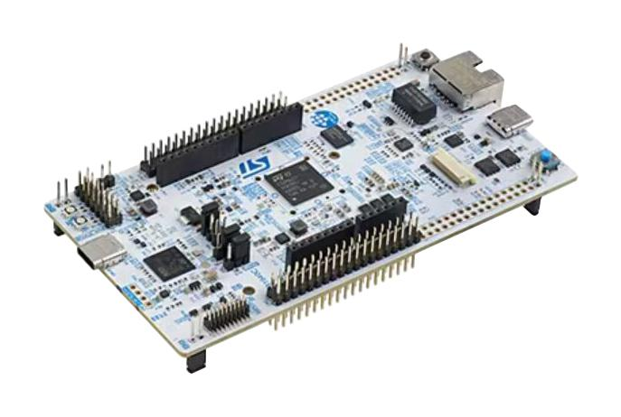
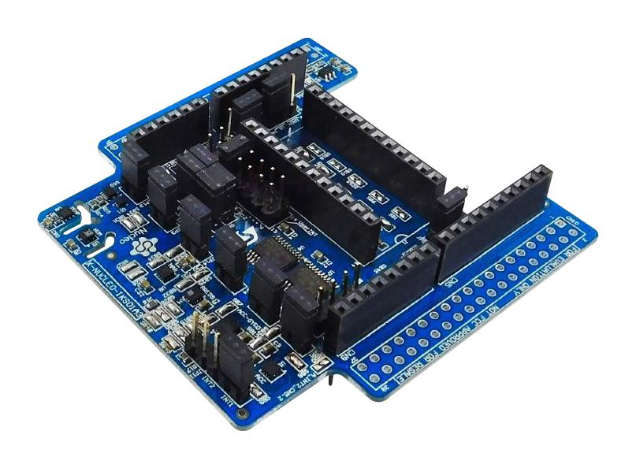
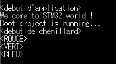
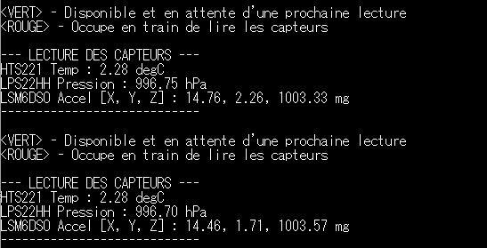
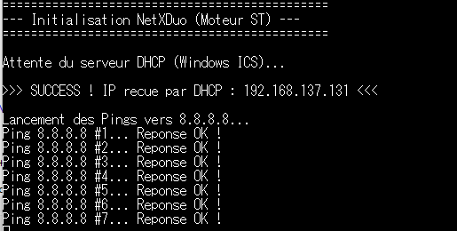
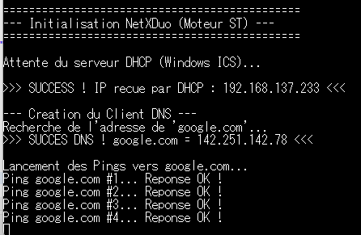

# TP2 — Interface Capteurs & STM32

<div align="center">


</div>

---

## 👥 Équipe

**Abdelnour ALEM · Faouzi MATMATI · Sophian MANGANELLO**  
L3 TRI — Université Savoie Mont Blanc | ETRS606 : IA Embarquée

---

## Introduction

Ce TP est centré sur la **programmation embarquée bas niveau** de la carte NUCLEO-N657X0. Il couvre trois niveaux d'intégration croissante :

1. **LED Blink & Chenillard** — prise en main de STM32CubeIDE et des GPIO
2. **Interface Capteurs I²C** — intégration des drivers STMicroelectronics pour lire des grandeurs physiques réelles
3. **Réseau Ethernet** — mise en place d'une pile réseau complète (NetXDuo + DHCP + DNS + ICMP) pour communiquer avec l'extérieur

---

## Matériel & Environnement

| Composant | Détail |
|-----------|--------|
| **Carte principale** | NUCLEO-N657X0 (ARM Cortex-M33 @ 160 MHz, 320 Ko RAM, 512 Ko Flash) |
| **Shield capteurs** | X-NUCLEO-IKS01A3 (capteurs MEMS via bus I²C) |
| **IDE** | STM32CubeIDE |
| **Middleware réseau** | NetXDuo (Azure RTOS) |
| **UART** | UART4 @ 115200 bauds (console de debug) |
| **Bus I²C** | I²C1 (capteurs) — Timing : `0x30C0EDFF` (mode standard) |

### Photos du matériel

| NUCLEO-N657X0 | X-NUCLEO-IKS01A3 |
|:---:|:---:|
|  |  |

---

## Partie 1 — LED Blink & Chenillard

### Objectif

Prendre en main STM32CubeIDE en implémentant un chenillard sur les trois LEDs de la carte (Rouge, Vert, Bleu) avec une temporisation de 3 secondes par LED, et en affichant les états sur la console UART.

### Implémentation

Le chenillard s'exécute en boucle infinie. Chaque LED s'allume pendant 3 secondes via `HAL_Delay(3000)`, les deux autres étant éteintes. Les états sont loggés via `printf` redirigé sur UART4.

```c
// Extrait de la boucle principale (main.c)
printf("<debut de chenillard>\r\n");

BSP_LED_On(LED_RED); BSP_LED_Off(LED_GREEN); BSP_LED_Off(LED_BLUE);
printf("<ROUGE>\r\n");
HAL_Delay(3000);

BSP_LED_Off(LED_RED); BSP_LED_On(LED_GREEN); BSP_LED_Off(LED_BLUE);
printf("<VERT>\r\n");
HAL_Delay(3000);

BSP_LED_Off(LED_RED); BSP_LED_Off(LED_GREEN); BSP_LED_On(LED_BLUE);
printf("<BLEU>\r\n");
HAL_Delay(3000);
```

### Résultat



*Figure 1 — Console UART affichant la séquence de démarrage et le chenillard : `<debut d'application>`, `<debut de chenillard>`, `<ROUGE>`, `<VERT>`, `<BLEU>`.*

---

## Partie 2 — Interface Capteurs (I²C)

### Objectif

Intégrer les drivers STMicroelectronics pour lire les valeurs des capteurs du shield X-NUCLEO-IKS01A3 via le bus I²C, et les afficher en grandeurs physiques réelles sur la console.

### Capteurs utilisés

| Capteur | Grandeur mesurée | Driver |
|---------|-----------------|--------|
| **HTS221** | Température (°C) | `hts221_reg.h/c` |
| **LPS22HH** | Pression atmosphérique (hPa) | `lps22hh_reg.h/c` |
| **LSM6DSO16IS** | Accélération 3 axes (mg) | `lsm6dso16is_reg.h/c` |

### Architecture logicielle

Les drivers ST s'appuient sur deux fonctions d'interface bas niveau à implémenter : `platform_read` et `platform_write`. Ces fonctions font le lien entre l'API des drivers et le HAL I²C de STM32.

```c
// Structure de contexte : lie le handle I²C et l'adresse du composant
typedef struct {
  I2C_HandleTypeDef *handle;
  uint16_t dev_addr;
} sensor_handle_t;

// Fonction d'écriture bas niveau
int32_t platform_write(void *handle, uint8_t reg, const uint8_t *bufp, uint16_t len) {
  sensor_handle_t *sens = (sensor_handle_t*)handle;
  uint8_t reg_addr = reg;
  // Auto-incrémentation nécessaire pour le HTS221
  if (sens->dev_addr == HTS221_I2C_ADDRESS) { reg_addr |= 0x80; }
  if (HAL_I2C_Mem_Write(sens->handle, sens->dev_addr, reg_addr,
      I2C_MEMADD_SIZE_8BIT, (uint8_t*)bufp, len, 1000) == HAL_OK)
    return 0;
  return -1;
}

// Fonction de lecture bas niveau (symétrique)
int32_t platform_read(void *handle, uint8_t reg, uint8_t *bufp, uint16_t len) {
  sensor_handle_t *sens = (sensor_handle_t*)handle;
  uint8_t reg_addr = reg;
  if (sens->dev_addr == HTS221_I2C_ADDRESS) { reg_addr |= 0x80; }
  if (HAL_I2C_Mem_Read(sens->handle, sens->dev_addr, reg_addr,
      I2C_MEMADD_SIZE_8BIT, bufp, len, 1000) == HAL_OK)
    return 0;
  return -1;
}
```

> **Point important :** Le HTS221 nécessite l'activation du bit d'auto-incrémentation (`reg |= 0x80`) pour les lectures/écritures multi-octets. Sans ce bit, la lecture des registres de calibration échoue silencieusement.

### Calibration du HTS221

La conversion des valeurs brutes en degrés Celsius nécessite une calibration d'usine lue une fois au démarrage :

```c
// Lecture des points de calibration
hts221_temp_deg_point_0_get(&dev_ctx_hts221, &t0_degC);
hts221_temp_deg_point_1_get(&dev_ctx_hts221, &t1_degC);
hts221_temp_adc_point_0_get(&dev_ctx_hts221, &t0_out);
hts221_temp_adc_point_1_get(&dev_ctx_hts221, &t1_out);

// Conversion interpolation linéaire
float temperature_degC = ((float)data_raw - t0_out) *
                         (t1_degC - t0_degC) / (t1_out - t0_out) + t0_degC;
```

### Indicateurs visuels LED

Les LEDs servent de repère visuel de l'état de la carte :

| LED | État |
|-----|------|
| 🟢 **VERT** | Disponible, en attente d'une prochaine lecture |
| 🔴 **ROUGE** | Occupé, en train de lire les capteurs |

### Résultats



*Figure 2 — Console UART affichant deux cycles de lecture. Les valeurs sont stables et cohérentes :*
- **HTS221 Temp : 22.28 °C** (température ambiante de la salle)
- **LPS22HH Pression : ~996.7 hPa** (pression atmosphérique normale)
- **LSM6DSO Accél [X, Y, Z] : ~14.8, ~2.3, ~1003.5 mg** (la composante Z ≈ 1000 mg correspond à la gravité terrestre, la carte étant posée à plat)

---

## Partie 3 — Réseau Ethernet (NetXDuo)

### Objectif

Mettre en place une pile réseau complète sur la NUCLEO-N657X0 pour obtenir une adresse IP par DHCP, résoudre un nom de domaine par DNS, et envoyer des pings ICMP vers `google.com`.

### Stack réseau utilisée

Contrairement à FreeRTOS + LWIP (mentionné dans le sujet), nous avons utilisé **Azure RTOS NetXDuo**, le middleware réseau fourni nativement par STM32CubeIDE pour le STM32N6. Cette stack est mieux intégrée à la carte et offre des performances supérieures.

| Couche | Implémentation |
|--------|---------------|
| **RTOS** | Azure RTOS ThreadX |
| **Stack IP** | NetXDuo |
| **Attribution IP** | DHCP client (`nx_dhcp`) |
| **Résolution DNS** | Client DNS (`nx_dns`) — serveur `8.8.8.8` |
| **Test connectivité** | ICMP Ping (`nx_icmp_ping`) |

### Fonctionnement du code

```c
// 1. Démarrage DHCP et attente de l'IP
nx_dhcp_start(&DHCPClient);
tx_semaphore_get(&DHCPSemaphore, TX_WAIT_FOREVER); // Bloquant jusqu'à IP reçue

// 2. Résolution DNS de google.com
nx_dns_create(&dns_client, &NetXDuoEthIpInstance, (UCHAR *)"Client DNS");
nx_dns_server_add(&dns_client, IP_ADDRESS(8, 8, 8, 8));
nx_dns_host_by_name_get(&dns_client, (UCHAR *)"google.com",
                         &destination_ip_address, 500);

// 3. Boucle de ping infinie
while(1) {
    status = nx_icmp_ping(&NetXDuoEthIpInstance, destination_ip_address,
                          "PING", 4, &my_packet, 200);
    if (status == NX_SUCCESS) {
        printf("Reponse OK !\r\n");
        nx_packet_release(my_packet);
    }
    tx_thread_sleep(100);
}
```

### Résultats

**Test 1 — Ping vers 8.8.8.8 (IP directe)**



*Figure 3 — IP obtenue par DHCP : `192.168.137.131`. Pings successifs vers `8.8.8.8` tous réussis (`Reponse OK !`).*

**Test 2 — Ping via résolution DNS de google.com**



*Figure 4 — IP obtenue : `192.168.137.233`. Résolution DNS réussie : `google.com = 142.251.142.78`. Pings vers cette IP tous réussis.*

---

## Conclusion

Ce TP a permis de maîtriser la chaîne complète d'intégration d'un système embarqué connecté :
- Programmation GPIO et gestion des LEDs comme indicateurs d'état
- Intégration de drivers fabricants via une couche d'abstraction I²C (`platform_read`/`platform_write`)
- Mise en place d'une pile réseau complète jusqu'au ping DNS fonctionnel

Les valeurs lues (2.28 °C, 996.7 hPa, g ≈ 1000 mg sur l'axe Z) sont physiquement cohérentes, validant le bon fonctionnement de l'ensemble de la chaîne d'acquisition.

Ces données capteurs (température, pression) seront utilisées dans les TPs suivants (TP3 & TP4) pour alimenter le modèle de classification météorologique Meteostat déployé sur le Cloud puis sur la carte elle-même.

---

## Ressources

- 📂 [Retour au dépôt principal](../README.md)
- 📄 [Sujet TP2 officiel — ETRS606](../docs/ETRS606_TP2.pdf)
- 🔗 [Drivers STMems Standard C](https://github.com/STMicroelectronics/STMems_Standard_C_drivers)
- 🔗 [Documentation NetXDuo](https://learn.microsoft.com/en-us/azure/rtos/netx-duo/)
