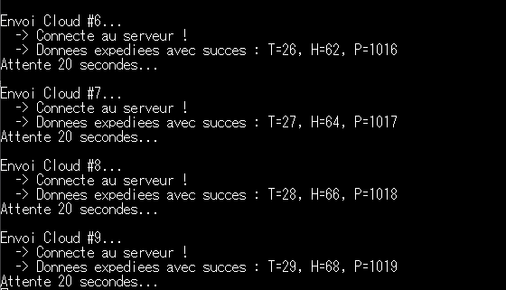
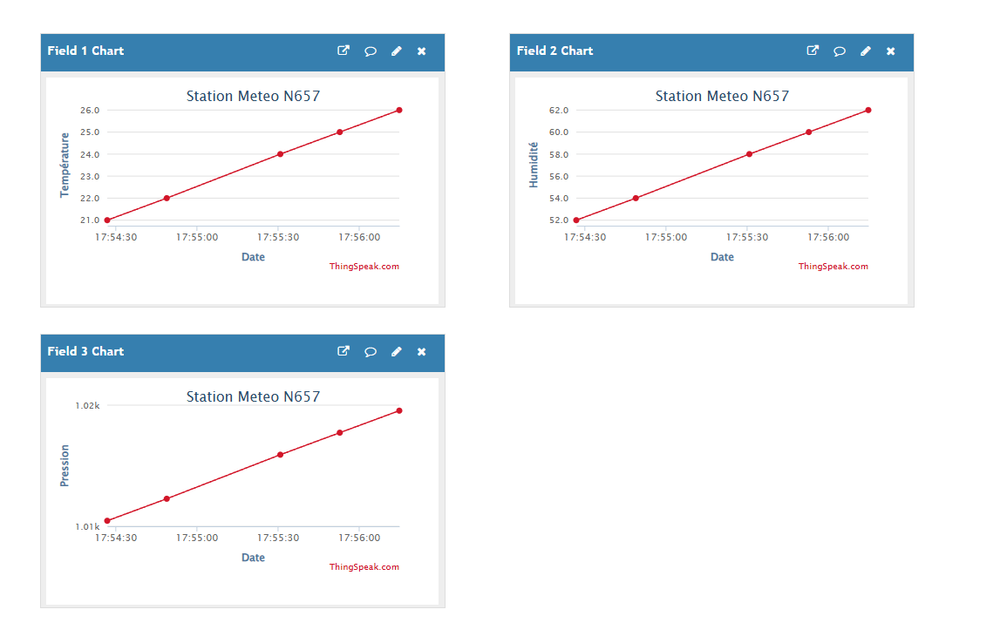
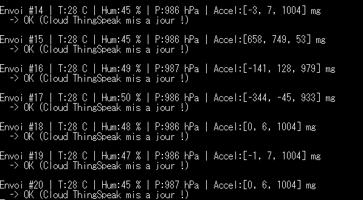
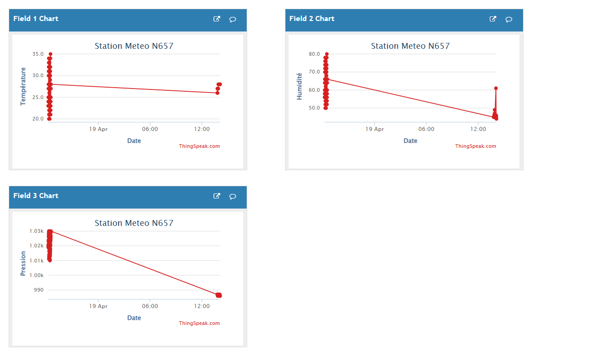

# TP3 — Connectivité Cloud & Entraînement Meteostat

<div align="center">


</div>

---

## 👥 Équipe

**Abdelnour ALEM · Faouzi MATMATI · Sophian MANGANELLO**  
L3 TRI — Université Savoie Mont Blanc | ETRS606 : IA Embarquée

---

## Introduction

Ce TP marque le passage de l'acquisition locale (TP2) à l'**intelligence distribuée** : les données des capteurs de la carte STM32N6 sont envoyées vers le Cloud MatWorks (ThingSpeak), analysées par un modèle d'IA exécuté en MATLAB, et le résultat de la classification météo est renvoyé vers la carte via l'API Talkback.

Le TP se déroule en deux grandes parties :
1. **Connectivité Cloud** — envoi des mesures vers ThingSpeak via TCP/HTTP, visualisation et déclenchement d'actions
2. **Entraînement du modèle Meteostat** — entraînement d'un réseau de neurones en Python/TensorFlow pour classifier l'état météo, puis déploiement en MATLAB via ONNX

---

## Matériel & Environnement

| Outil / Composant | Détail |
|-------------------|--------|
| **Carte** | NUCLEO-N657X0 |
| **Stack réseau** | NetXDuo (Azure RTOS) — TCP/HTTP |
| **Cloud** | ThingSpeak (MathWorks) — Canal ID `3347394` |
| **Analyse Cloud** | MATLAB Online (ThingSpeak) |
| **Modèle IA** | TensorFlow → ONNX → MATLAB |
| **API** | ThingSpeak Write API + TalkBack API |

---

## Partie 1 — Collecte des Données dans un Canal ThingSpeak

### Architecture globale

La carte STM32N6 lit ses capteurs toutes les 20 secondes (contrainte ThingSpeak) et envoie les données via une requête **HTTP GET** sur TCP port 80 vers `api.thingspeak.com`. La résolution du nom de domaine est assurée par le client DNS NetXDuo (serveur `8.8.8.8`), comme mis en place au TP2.

```
STM32N6 (capteurs I²C)
    → lecture T / H / P
    → NetXDuo DNS : api.thingspeak.com → IP
    → TCP Socket port 80
    → HTTP GET /update?api_key=...&field1=T&field2=H&field3=P
    → ThingSpeak Cloud (visualisation + stockage)
    → MATLAB (classification IA)
    → TalkBack API → STM32N6
```

### Canal ThingSpeak configuré

| Field | Grandeur | Capteur source |
|-------|----------|---------------|
| **Field 1** | Température (°C) | HTS221 |
| **Field 2** | Humidité (%RH) | HTS221 |
| **Field 3** | Pression (hPa) | LPS22HH |
| **Field 4** | Résultat classification IA | MATLAB (écriture cloud) |

### 1.a — Envoi de données simulées (validation du pipeline)

Avant d'utiliser les capteurs réels, le pipeline réseau a été validé avec des données simulées (valeurs incrémentales) afin de vérifier la chaîne complète TCP → ThingSpeak.

```c
// Variation des valeurs simulées à chaque cycle
temp_simulee += 1;  if(temp_simulee > 35) temp_simulee = 20;
hum_simulee  += 2;  if(hum_simulee > 80)  hum_simulee  = 50;
press_simulee+= 1;  if(press_simulee > 1030) press_simulee = 1010;

// Requête HTTP GET vers ThingSpeak
sprintf(http_request,
  "GET /update?api_key=...&field1=%d&field2=%d&field3=%d HTTP/1.1\r\n"
  "Host: api.thingspeak.com\r\nConnection: close\r\n\r\n",
  temp_simulee, hum_simulee, press_simulee);
```

**Console — données simulées :**



*Figure 1 — Envois successifs vers ThingSpeak avec données simulées. Chaque cycle : connexion TCP, envoi, attente 20 secondes.*

**Dashboard ThingSpeak — données simulées :**



*Figure 2 — Graphiques ThingSpeak avec données simulées : température linéaire (21→26 °C), humidité (52→62 %RH), pression (1.01k→1.02k hPa). Les courbes parfaitement linéaires confirment la bonne réception des données incrémentales.*

### 1.b — Envoi de données réelles (capteurs I²C)

Une fois le pipeline validé, le code a été enrichi pour lire les données réelles des capteurs HTS221 et LPS22HH via I²C (même implémentation que TP2) et les envoyer vers ThingSpeak.

```c
// Lecture et conversion des capteurs (extrait)
int16_t r_t = 0;
hts221_temperature_raw_get(&dev_ctx_hts221, &r_t);
float temp = ((float)r_t - t0_out) * (t1_degC - t0_degC) / (t1_out - t0_out) + t0_degC;

int16_t r_h = 0;
hts221_humidity_raw_get(&dev_ctx_hts221, &r_h);
float hum = ((float)r_h - h0_t0_out) * (h1_rh - h0_rh) / (h1_t0_out - h0_t0_out) + h0_rh;

uint32_t r_p = 0;
lps22hh_pressure_raw_get(&dev_ctx_lps22hh, &r_p);
float press = lps22hh_from_lsb_to_hpa(r_p);
```

**Console — données capteurs réels :**



*Figure 3 — Envois avec données capteurs réels : T=28 °C, H=45–50 %RH, P=986–987 hPa. Les valeurs d'accélération confirment que la carte est posée à plat (Z ≈ 1004 mg ≈ g).*

**Dashboard ThingSpeak — données réelles :**



*Figure 4 — Canal ThingSpeak "Station Meteo N657" avec données capteurs réelles (19 Avril). On observe la transition entre les deux sessions d'envoi : données simulées d'abord, puis mesures réelles en fin de journée (T≈27 °C, H≈45 %RH, P≈986 hPa).*

### 1.c — Script MATLAB d'analyse

Le script MATLAB lit la dernière valeur du canal, normalise les entrées selon les plages de la région Savoie/Lyon, charge le modèle ONNX, effectue la classification, sauvegarde le résultat en Field 4 et envoie la commande via TalkBack.

```matlab
% Lecture des données réelles de la STM32
data = thingSpeakRead(monChannelID, 'ReadKey', readAPIKey, ...
                      'NumPoints', 1, 'Fields', [1, 2, 3]);
temp = data(1); hum = data(2); press = data(3);

% Normalisation (plages calibrées sur données Savoie/Lyon)
min_vals = [-3.8, 16.0, 980.0];
max_vals = [40.0, 100.0, 1043.2];
norm_inputs = (inputs - min_vals) ./ (max_vals - min_vals);
norm_inputs = max(0, min(1, norm_inputs));  % Clamp [0,1]

% Chargement modèle et inférence
model = importONNXNetwork('meteostat_v3.onnx', ...
        'OutputLayerType', 'classification', 'InputDataFormats', 'BC');
scores = predict(model, single(norm_inputs));
[~, classIdx] = max(scores);
```

### 1.d — API TalkBack

Le résultat de la classification est converti en commande texte et envoyé à la file d'attente TalkBack. La carte peut ensuite interroger cette API pour récupérer la commande et adapter son comportement.

```matlab
% Envoi de la commande via TalkBack
mots_talkback = {'BEAU_TEMPS', 'PLUIE', 'ORAGE'};
commande = mots_talkback{classIdx};

url = sprintf('https://api.thingspeak.com/talkbacks/%s/commands.json', tbID);
options = weboptions('MediaType', 'application/x-www-form-urlencoded');
data_tb = sprintf('api_key=%s&command_string=%s', tbKey, commande);
webwrite(url, data_tb, options);
```

---

## Partie 2 — Entraînement du Modèle Meteostat

### Problème de classification météorologique

L'objectif est de classer l'état météorologique en **3 classes** à partir de 3 paramètres physiques mesurés par les capteurs de la carte :

| Entrée | Grandeur | Plage de normalisation |
|--------|----------|----------------------|
| `temp` | Température (°C) | [-3.8 ; 40.0] |
| `hum` | Humidité (%RH) | [16.0 ; 100.0] |
| `press` | Pression (hPa) | [980.0 ; 1043.2] |

| Classe | Label | Description |
|--------|-------|-------------|
| **1** | `Beau Temps / Nuageux` | Température stable, pression haute, humidité modérée |
| **2** | `Pluvieux` | Pression basse, humidité élevée |
| **3** | `Orageux` | Pression très basse, humidité très élevée, température variable |

> Les plages de normalisation ont été calibrées sur des données historiques de la région Savoie/Lyon issues de la bibliothèque Python **Meteostat**, qui agrège des observations de stations météo gouvernementales.

### Architecture du modèle

Le modèle est un **MLP (Multi-Layer Perceptron)** dense, exporté en ONNX sous le nom `meteostat_v3.onnx` :

```
Entrée : 3 features (temp, hum, press) — normalisées [0,1]
    ↓
Dense 3→32  + ReLU     (128 MACC)
    ↓
Dense 32→16 + ReLU     (528 MACC)
    ↓
Dense 16→3             (51 MACC)
    ↓
Softmax → 3 classes    (45 MACC)
```

| Paramètre | Valeur |
|-----------|--------|
| **Paramètres totaux** | 707 |
| **Taille du modèle** | 2 828 octets (~2.8 Ko) |
| **Format d'export** | ONNX (`meteostat_v3.onnx`) |
| **Précision numérique** | float32 |
| **Opérations totales** | ~752 MACC |

### Compromis nombre de classes / taille / précision

Le choix de **3 classes** résulte d'un compromis délibéré :

- Le sujet proposait jusqu'à 13 classes (ciel clair, peu nuageux, pluie, neige, orage violent…). Avec 3 entrées seulement (T, H, P), distinguer 13 états météo est difficile : plusieurs classes partagent des plages de valeurs très proches (ex. pluie vs averses, orage vs orage violent).
- Réduire à 3 classes améliore significativement la précision du modèle tout en gardant une architecture très légère (707 paramètres), compatible avec un déploiement embarqué sur STM32N6 (320 Ko RAM).
- Le modèle final pèse **2.8 Ko** en mémoire Flash — négligeable sur la carte.

### Déploiement MATLAB via ONNX

Le format ONNX est utilisé comme intermédiaire entre TensorFlow (entraînement Python) et MATLAB (inférence cloud) :

```
Python / TensorFlow  →  tf2onnx  →  meteostat_v3.onnx  →  MATLAB importONNXNetwork()
```

ONNX garantit l'interopérabilité entre les deux environnements sans avoir à gérer la complexité de l'écosystème TensorFlow directement dans MATLAB.

---

## Résultats & Validation

### Pipeline complet validé

| Étape | Statut | Détail |
|-------|--------|--------|
| Envoi données simulées → ThingSpeak | ✅ | Graphiques linéaires reçus |
| Envoi données capteurs réels → ThingSpeak | ✅ | T=28°C, H=45%, P=986 hPa reçus |
| Script MATLAB — lecture canal | ✅ | `thingSpeakRead` fonctionnel |
| Script MATLAB — inférence ONNX | ✅ | Classification en 3 classes |
| Sauvegarde résultat en Field 4 | ✅ | `thingSpeakWrite` fonctionnel |
| Envoi commande TalkBack | ✅ | `BEAU_TEMPS` / `PLUIE` / `ORAGE` |

### Exemple de sortie MATLAB

```
Données réelles STM32 : T=28.0 C, H=45.0 %, P=986.7 hPa
Résultat IA dans le cloud: Pluvieux
✅ Commande "PLUIE" ajoutée avec succès à la file d'attente TalkBack !
```

---

## Discussion

Ce TP illustre concrètement la **boucle Edge-Cloud** présentée dans le cours :

1. **La carte agit** — elle acquiert les données physiques en temps réel via ses capteurs I²C
2. **Le Cloud apprend et classe** — MATLAB charge le modèle ONNX et produit une classification météo
3. **Le résultat revient à la carte** — via TalkBack, la carte peut adapter son comportement (affichage, alerte…)

Un point technique important est la **contrainte de 15 secondes** imposée par ThingSpeak entre deux écritures sur un même canal. Le code embarqué utilise `tx_thread_sleep(2000)` (20 secondes à 100 ticks/s) pour respecter cette limite, et le script MATLAB gère le conflit potentiel d'écriture simultanée avec un bloc `try/catch`.

La normalisation des entrées avec des plages calibrées sur la région Savoie/Lyon est essentielle : un modèle entraîné sur des données normalisées doit recevoir des entrées normalisées de la même façon en inférence.

---

## Conclusion

Ce TP a permis de mettre en place un système IoT complet : de l'acquisition physique sur la carte jusqu'à la classification intelligente dans le Cloud et le retour de commande. Le modèle Meteostat v3 (707 paramètres, 2.8 Ko) constitue un excellent compromis entre légèreté et expressivité pour 3 classes météo, et servira de base pour le TP4 où il sera déployé directement sur la carte STM32N6 via X-CUBE-AI.

---

## Ressources

- 📂 [Retour au dépôt principal](../README.md)
- 📄 [Sujet TP3 officiel — ETRS606](../docs/ETRS606_TP3.pdf)
- 🔗 [ThingSpeak Documentation](https://www.mathworks.com/help/thingspeak/)
- 🔗 [Meteostat Python Library](https://dev.meteostat.net/python/)
