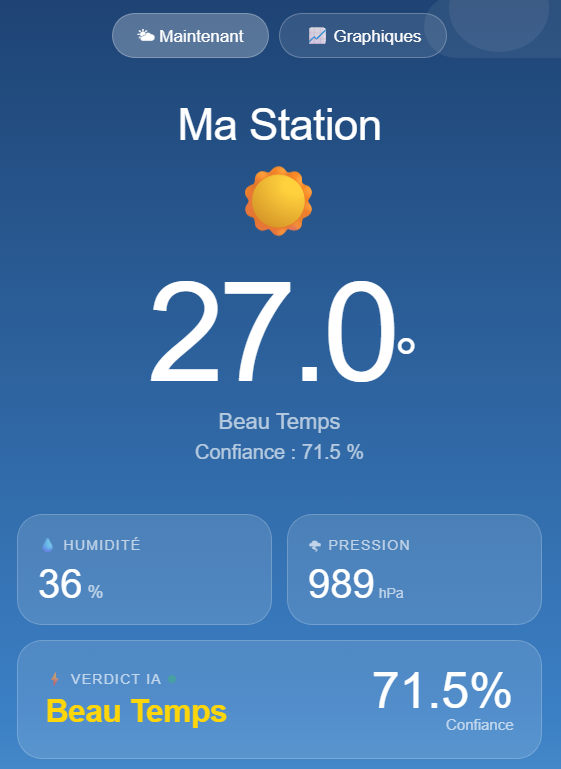
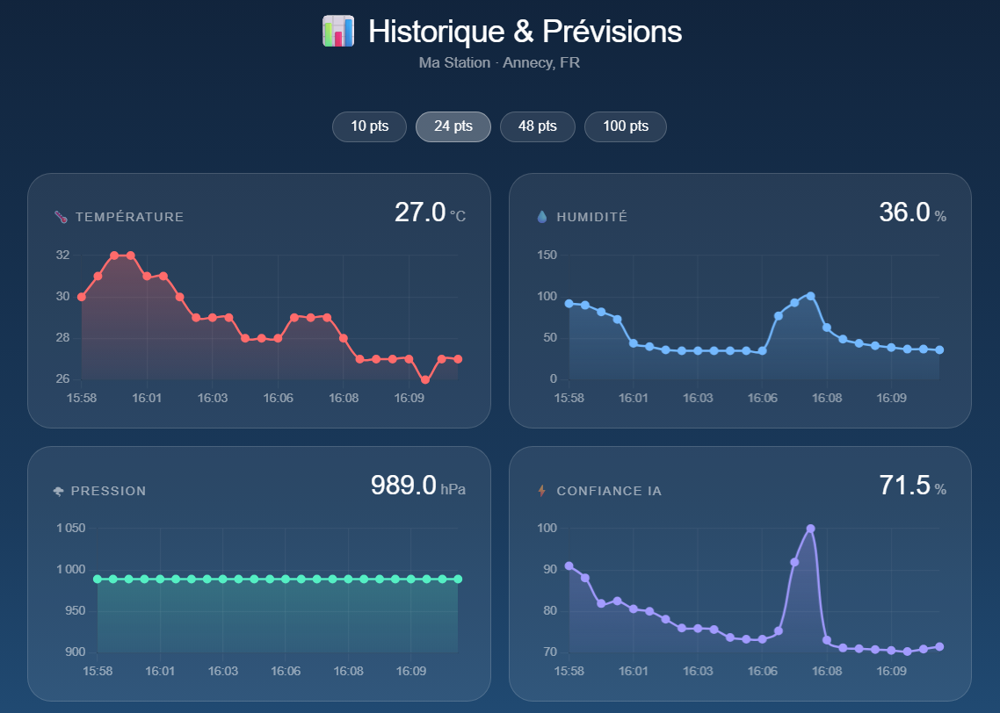
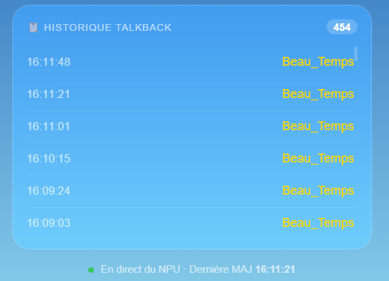
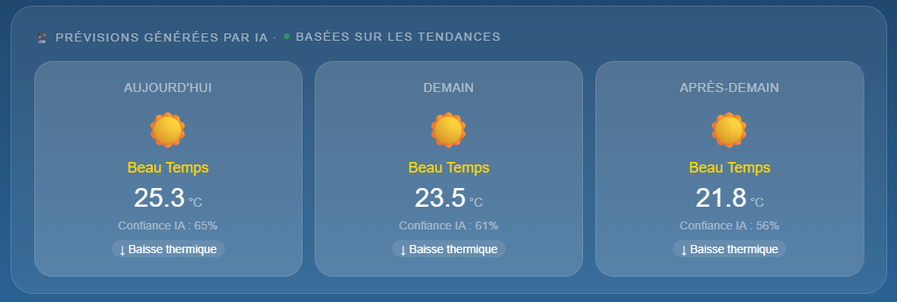
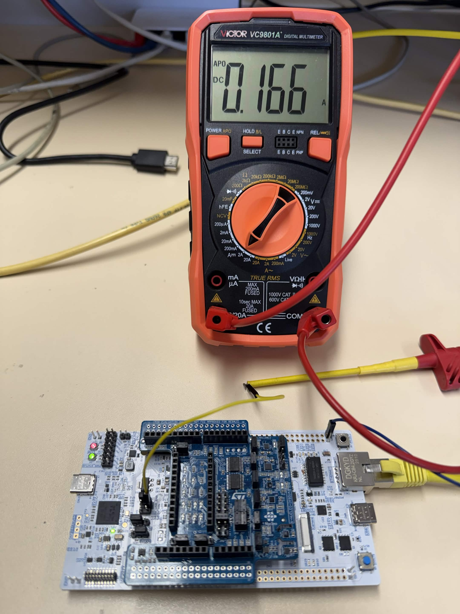
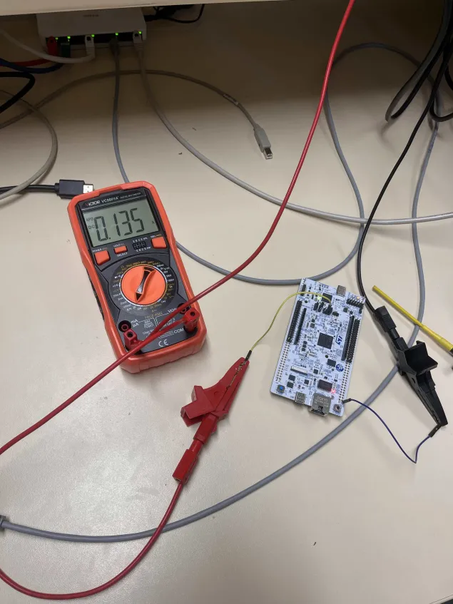

# TP4 — Cloud versus Edge AI

<div align="center">


</div>

---

## 👥 Équipe

**Abdelnour ALEM · Faouzi MATMATI · Sophian MANGANELLO**  
L3 TRI — Université Savoie Mont Blanc | ETRS606 : IA Embarquée

---

## Introduction

Ce TP concrétise la convergence entre les acquis des TPs précédents : le modèle Meteostat entraîné en Python (TP3) est déployé **directement sur la carte STM32N6** via X-CUBE-AI, permettant une inférence locale sur le CPU Cortex-M33 via X-CUBE-AI. La carte devient ainsi une station météo intelligente autonome, capable de classifier l'état météo sans dépendre du Cloud pour le calcul.

En parallèle, un **site web temps réel** hébergé sur GitHub Pages agrège et visualise les données envoyées par la carte vers ThingSpeak.

---

## Matériel & Environnement

| Composant | Détail |
|-----------|--------|
| **Carte** | NUCLEO-N657X0 (ARM Cortex-M33 + NPU Neural-ART 600 GOPS — inférence exécutée sur CPU) |
| **Shield** | X-NUCLEO-IKS01A3 (HTS221, LPS22HH, LSM6DSO16IS) |
| **Framework IA embarquée** | X-CUBE-AI (ST Edge AI Core v2.2.0) |
| **Modèle** | `meteostat_v3.onnx` (707 paramètres, 2 828 octets) |
| **Cloud** | ThingSpeak — Canal ID `3347394` |
| **Dashboard** | GitHub Pages — [fma-cmd.github.io/station-meteo-stm32](https://fma-cmd.github.io/station-meteo-stm32/) |
| **Multimètre** | VICTOR VC9801A (mesure courant DC) |

---

## Partie 1 — Neural Network dans le Cloud (MATLAB / ThingSpeak)

Le modèle Meteostat v3 a été déployé côté Cloud dans le TP3 via MATLAB et l'API ThingSpeak. Le script MATLAB lit les données du canal, normalise les entrées, charge le réseau via `importONNXNetwork()` et écrit le résultat de la classification en Field 4.

Ce pipeline Cloud sert de **référence de comparaison** pour évaluer l'approche Edge AI de la Partie 2.

---

## Partie 2 — Neural Network dans la carte STM32N6

### 2.a — Export du modèle : TensorFlow → ONNX → C (X-CUBE-AI)

Le modèle entraîné en Python/TensorFlow a été converti en ONNX puis importé dans STM32CubeIDE via **X-CUBE-AI** (ST Edge AI Core) pour générer le code C d'inférence :

```
Python / TensorFlow
    → tf2onnx → meteostat_v3.onnx
    → X-CUBE-AI (ST Edge AI Core v2.2.0, target: stm32n6)
    → network.c / network.h / network_data.c / network_data.h
```

**Caractéristiques du modèle généré :**

| Paramètre | Valeur |
|-----------|--------|
| Paramètres totaux | 707 |
| Taille poids (Flash) | 2 828 octets |
| Mémoire activations (RAM) | 192 octets |
| Mémoire kernel (RAM) | 1 988 octets |
| Opérations totales | ~752 MACC |
| Format | float32 |

> Le modèle est remarquablement léger : **2.8 Ko de Flash** et moins de **2 Ko de RAM** pour l'inférence, largement dans les limites des 512 Ko Flash / 320 Ko RAM de la carte.

### 2.b — Implémentation C — Inférence Edge AI

L'inférence est intégrée dans la boucle principale du thread NetXDuo, entre la lecture des capteurs et l'envoi vers le Cloud :

```c
// Initialisation du réseau IA
ai_error err = ai_network_create(&network, AI_NETWORK_DATA_CONFIG);
ai_network_params params;
params.params = AI_NETWORK_DATA_WEIGHTS(ai_network_data_weights_get());
params.activations = AI_NETWORK_DATA_ACTIVATIONS(NULL);
ai_network_init(network, &params);

// Récupération des buffers d'entrée/sortie
ai_input  = ai_network_inputs_get(network, NULL);
ai_output = ai_network_outputs_get(network, NULL);
```

```c
// Normalisation des entrées (même plage que l'entraînement)
float min_vals[3] = {-3.8f, 16.0f,  980.0f};
float max_vals[3] = {40.0f, 100.0f, 1043.2f};

float *in_ptr  = (float *)ai_input[0].data;
float *out_ptr = (float *)ai_output[0].data;

in_ptr[0] = (temp  - min_vals[0]) / (max_vals[0] - min_vals[0]);
in_ptr[1] = (hum   - min_vals[1]) / (max_vals[1] - min_vals[1]);
in_ptr[2] = (press - min_vals[2]) / (max_vals[2] - min_vals[2]);

// Clamp [0, 1]
for(int i = 0; i < 3; i++) {
    if(in_ptr[i] < 0.0f) in_ptr[i] = 0.0f;
    if(in_ptr[i] > 1.0f) in_ptr[i] = 1.0f;
}

// Inférence sur CPU (Cortex-M33, via X-CUBE-AI — mapping NODE_SW)
ai_network_run(network, &ai_input[0], &ai_output[0]);

// Argmax — recherche de la classe dominante
float max_prob = -1.0f; int class_idx = 0;
for(int i = 0; i < 3; i++) {
    if(out_ptr[i] > max_prob) { max_prob = out_ptr[i]; class_idx = i; }
}

const char* labels[] = {"Beau_Temps", "Pluvieux", "Orageux"};
printf("--> EDGE AI VERDICT : %s (Probabilite: %.1f %%)\r\n",
       labels[class_idx], max_prob * 100.0f);
```

### 2.c — Résultats de la classification Edge AI

**Dashboard temps réel — "Ma Station" :**



*Figure 1 — Dashboard web de la station météo. T=27.0°C, H=36%, P=989 hPa. Verdict Edge AI : **Beau Temps** avec une confiance de **71.5%**. Les données sont lues depuis ThingSpeak en temps réel.*

**Historique & Prévisions (Annecy, FR) :**



*Figure 2 — Historique sur 24 points (session du jour). Température entre 26 et 32°C, pression stable à ~989 hPa, humidité variable (35–100%). La courbe de confiance IA montre un pic à 100% lors d'un pic d'humidité (16:08), puis retour à ~71% en fin de session.*

**Historique TalkBack :**



*Figure 3 — File d'attente TalkBack avec 454 commandes enregistrées. Toutes les commandes émises entre 16:09 et 16:11 sont `Beau_Temps`, cohérent avec les mesures. La mention "En direct du NPU" (mention du dashboard web) confirme que c'est la carte qui pilote le flux.*

**Prévisions générées par IA :**



*Figure 4 — Prévisions sur 3 jours basées sur la tendance thermique détectée : Aujourd'hui 25.3°C (65%), Demain 23.5°C (61%), Après-demain 21.8°C (56%). Tendance : baisse thermique progressive. La confiance décroît avec l'horizon temporel, ce qui est physiquement cohérent.*

### 2.d — Mesure de la consommation

La consommation de la carte lors de l'exécution du système complet (capteurs + inférence CPU + envoi réseau) a été mesurée en série avec un multimètre **VICTOR VC9801A** sur le jumper d'alimentation.




*Figure 5 — Mesure en courant continu : **I = 0.166 A** et **V = 6.5 V** .*

| Grandeur | Valeur |
|----------|--------|
| Tension d'alimentation | 6.5 V |
| Courant mesuré | **0.166 A** |
| **Puissance totale** | **1.079 W** |

> Cette mesure inclut l'ensemble du système en fonctionnement : microcontrôleur (CPU Cortex-M33), shield capteurs (3 capteurs I²C), interface Ethernet (PHY + câble RJ45). Elle représente la consommation du système **complet en production**.

---

## Comparaison Cloud AI vs Edge AI

| Critère | Cloud AI (MATLAB/ThingSpeak) | Edge AI (STM32N6 CPU) |
|---------|-----------------------------|-----------------------|
| **Lieu d'inférence** | Serveur MathWorks (Cloud) | Carte STM32N6 (local) |
| **Modèle** | `meteostat_v3.onnx` via MATLAB | `meteostat_v3.onnx` via X-CUBE-AI |
| **Latence** | Dépend du réseau + serveur | Quasi-instantanée (CPU local) |
| **Connectivité requise** | Oui (Internet obligatoire) | Non (fonctionne hors ligne) |
| **Consommation inférence** | Non mesurable (serveur distant) | Incluse dans 1.079 W |
| **Taille modèle embarqué** | N/A (côté serveur) | 2 828 octets Flash |
| **RAM inférence** | N/A | 192 o activations + 1 988 o kernel |
| **Résultat classification** | Identique (`Beau_Temps`) | Identique (`Beau_Temps`) |
| **Confiance** | Non affichée | 71.5% |

Les deux approches produisent le même résultat de classification pour les mêmes entrées, ce qui valide la cohérence du pipeline TensorFlow → ONNX → MATLAB / X-CUBE-AI.

---

## Site Web Temps Réel

Un site web a été développé et hébergé sur **GitHub Pages** pour visualiser les données de la station en temps réel, en interrogeant l'API ThingSpeak côté client :

🔗 **[fma-cmd.github.io/station-meteo-stm32](https://fma-cmd.github.io/station-meteo-stm32/)**

**Fonctionnalités :**
- Affichage temps réel de T, H, P et du verdict IA avec confiance
- Historique graphique sur 10 / 24 / 48 / 100 points
- Prévisions IA sur 3 jours basées sur la tendance thermique
- Historique des commandes TalkBack émises par la carte
- Mise à jour automatique toutes les 20 secondes

---

## Discussion & Analyse de Soutenabilité (P_TEDS)

### Pertinence de l'Edge AI pour ce cas d'usage

Contrairement au projet Sin(x) (où l'IA n'apporte aucun avantage sur une formule analytique), le problème météo justifie l'IA : la relation entre température, humidité et pression n'est pas linéaire et ne peut pas être modélisée par une simple règle déterministe.

### Bilan énergétique

La consommation mesurée (1.079 W) est celle du **système complet**. À titre de comparaison, un serveur Cloud typique consomme entre 200 W et 500 W pour des milliers d'inférences simultanées. Ramené à une inférence unique, le coût énergétique par classification est nettement plus favorable en Edge.

### Limites identifiées

- Le modèle à 3 classes est volontairement simplifié. Des conditions météo intermédiaires (brouillard, vent fort) ne sont pas couvertes.
- La confiance de 71.5% en conditions de "Beau Temps" indique que le modèle est relativement certain mais pas parfait — ce qui est attendu avec seulement 3 entrées physiques.
- La confiance décroît avec l'horizon de prévision, ce qui est physiquement cohérent et honnête.

---

## Conclusion

Ce TP a permis de déployer un système d'IA embarquée complet et fonctionnel : de la lecture des capteurs à l'inférence locale sur NPU, en passant par la télémétrie Cloud et la visualisation web en temps réel. Le modèle Meteostat v3 (2.8 Ko, 707 paramètres) s'exécute sur le CPU Cortex-M33 de la STM32N6 via X-CUBE-AI pour une consommation totale de 1.079 W, avec un résultat identique à celui obtenu côté Cloud MATLAB — validant l'ensemble de la chaîne de déploiement.

---

## Ressources

- 🌐 [Dashboard temps réel](https://fma-cmd.github.io/station-meteo-stm32/)
- 📂 [Retour au dépôt principal](../README.md)
- 📄 [Sujet TP4 officiel — ETRS606](../docs/ETRS606_TP4.pdf)
- 🔗 [X-CUBE-AI Documentation](https://www.st.com/en/embedded-software/x-cube-ai.html)
